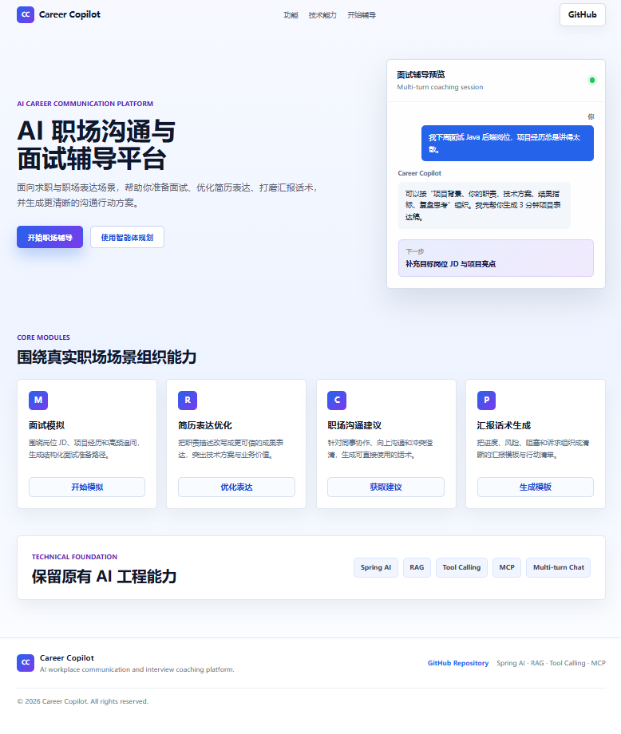
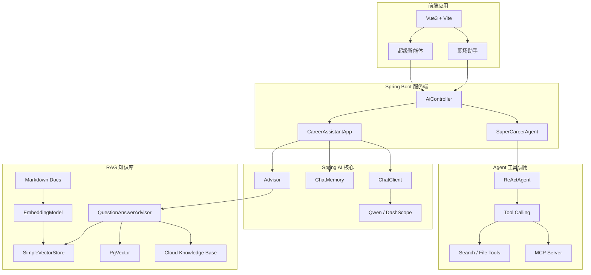

# Z-Career-Copilot

## 项目简介

Z-Career-Copilot 是一个基于 Spring AI 与 MCP 构建的 AI 职场沟通辅助平台，  
聚焦面试辅导、表达优化、任务规划与智能问答等真实职场场景，  
提供具备多轮会话记忆、RAG 检索增强、Tool Calling 与智能体规划能力的 AI 助手。

项目结合 Spring AI、ReAct Agent 与 MCP 扩展机制，  
支持联网搜索、知识检索、工具调用与复杂任务执行，  
可基于本地 VectorStore、PgVector 或云知识库实现 RAG 检索增强，
用于构建具备自主分析与辅助决策能力的 AI 职场助手。

---

## 核心功能

- 职场沟通辅导：支持面试问答、汇报表达、职场沟通优化等场景辅助
- 智能任务规划：基于用户目标自动生成阶段性行动方案
- 多轮对话记忆：结合上下文实现连续对话与历史语义关联
- RAG 知识检索：支持本地 VectorStore、PgVector 与云知识库扩展
- Tool Calling 工具调用：支持搜索、文件处理等外部工具扩展
- ReAct 智能体：支持复杂任务分解与自主推理执行
- MCP 扩展机制：支持后续接入更多外部服务与 AI 工具

---

## 项目预览

### Career Copilot 首页工作台



首页采用现代 SaaS 风格设计，聚合职场沟通辅导、智能任务规划、面试准备与表达优化等核心入口，突出 AI 职场助手的产品定位与智能体交互能力。

---

## 系统架构



---

## AI 能力说明

### RAG 检索增强

基于 Markdown 知识库、EmbeddingModel 与 VectorStore 构建 RAG 检索链路，  
支持本地内存向量库、PgVector 以及云知识库扩展，  
结合 QuestionAnswerAdvisor 实现上下文增强生成，提高职场问答的专业性与准确性。

### ReAct Agent

项目基于 ReAct 思维模型实现智能体执行流程：

```text
Thought -> Action -> Observation -> Reasoning -> Final Answer
```

智能体能够根据用户任务自主判断是否需要调用工具，并结合工具结果进行多步推理与任务执行。

### Tool Calling & MCP

系统支持 Tool Calling 工具调用机制，并预留 MCP Server 扩展能力，  
可接入联网搜索、文件操作、图片获取等外部服务，提升复杂任务处理能力。

---

## 技术栈

### 后端

- Spring Boot 3
- Spring AI
- DashScope / Qwen
- SSE 流式输出
- RAG 检索增强
- Tool Calling
- MCP

### 前端

- Vue3
- Vite
- Element Plus

### AI / Agent

- ChatClient
- ChatMemory
- EmbeddingModel
- QuestionAnswerAdvisor
- SimpleVectorStore
- PgVector
- ReActAgent
- Tool Calling
- MCP

---

## 项目亮点

- 基于 Spring AI 构建完整 AI 应用链路
- 支持 RAG + Agent + Tool Calling 综合能力
- 支持 SSE 流式响应与多轮上下文记忆
- 基于 ReAct 实现智能体自主推理
- 支持 MCP 扩展与外部工具接入
- 支持本地 VectorStore、PgVector 与云知识库扩展
- 面向真实职场沟通与面试辅助场景设计
