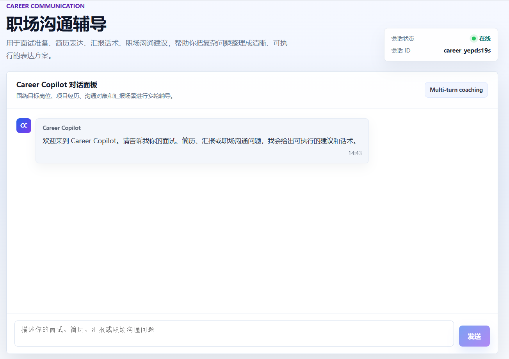
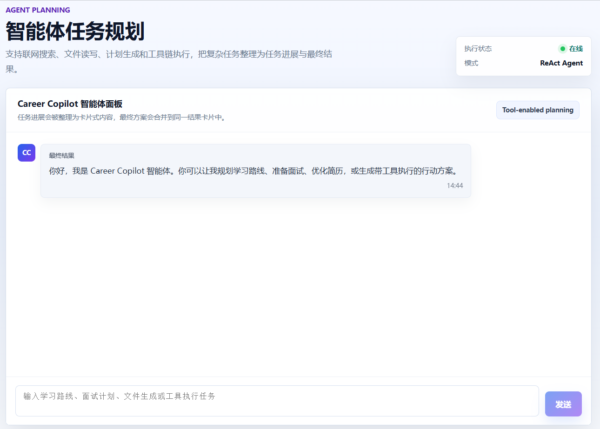
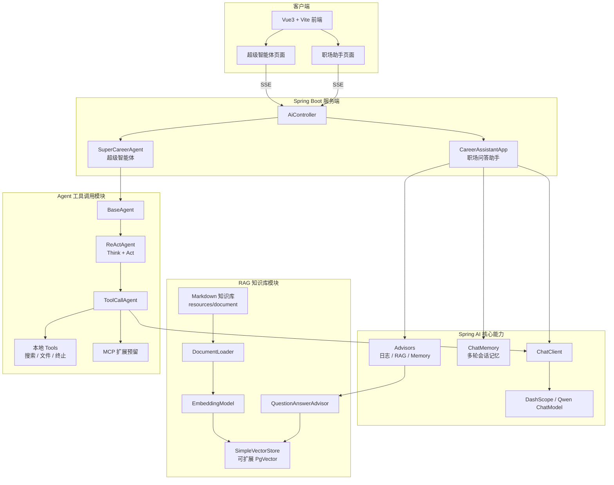
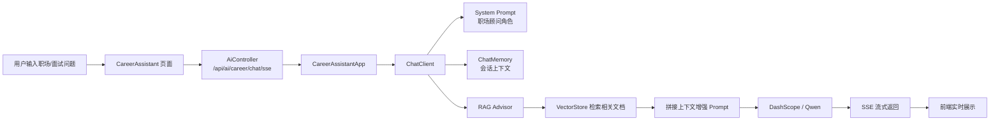
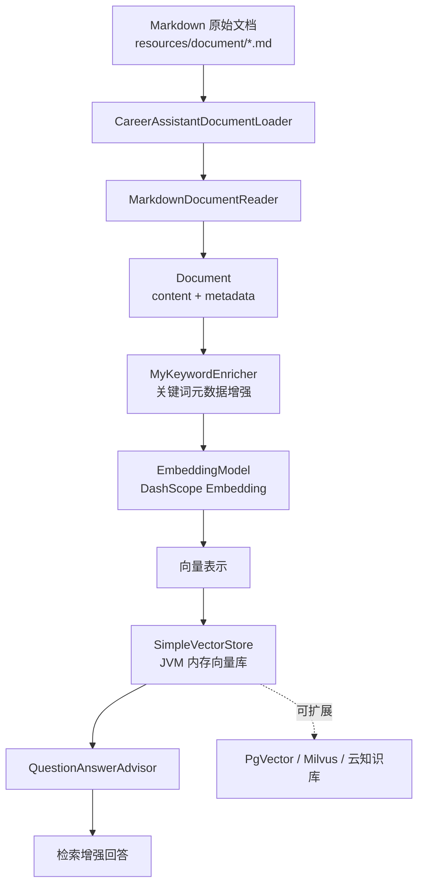
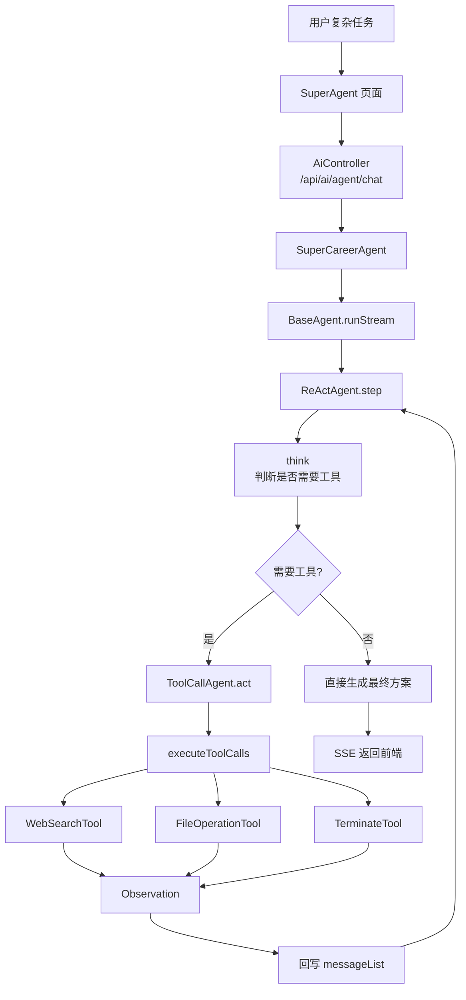
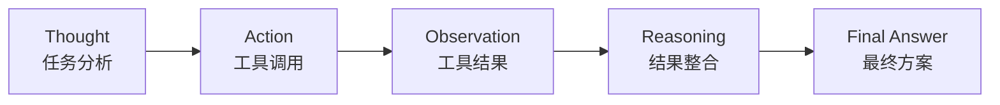

# Z-Career-Copilot README

## 1. 项目页面展示

### 首页：Career Copilot 工作台


说明文案：

```text
首页采用现代 SaaS 风格设计，聚合职场沟通辅导、智能体任务规划、面试准备、简历表达优化等核心入口，突出 AI 职场助手的产品定位。
```

---

### 职场沟通与面试辅导页面



说明文案：

```text
职场助手面向面试准备、简历表达、汇报话术、同事协作和领导沟通等场景，结合系统 Prompt、多轮会话记忆和 RAG 知识库，生成可直接套用的建议与话术。
```

---

### 超级智能体任务规划页面



说明文案：

```text
超级智能体基于 ReAct + Tool Calling 实现多步任务规划，支持联网搜索、文件读写、结果整理和任务终止等工具能力，适合处理复杂职场任务。
```

---

# 2. 系统整体架构图



---

# 3. 职场问答助手 RAG 链路



---

# 4. RAG 知识库构建图



---

# 5. 超级智能体执行链路



---

# 6. ReAct + Tool Calling 思维模型



---


# 7. README 项目亮点

```text
Z-Career-Copilot 是一个基于 Spring Boot 与 Spring AI 构建的 AI 职场沟通与面试辅导平台，面向求职、面试、简历表达、汇报沟通和职场协作等真实场景，提供 RAG 知识库问答、SSE 流式响应、ReAct 智能体规划和 Tool Calling 工具调用能力。

项目包含两个核心模块：

1. 职场问答助手：基于 ChatClient、系统 Prompt、多轮会话记忆和 RAG 检索增强，实现面向职场场景的专业问答与话术生成。
2. 超级智能体：基于 BaseAgent、ReActAgent 和 ToolCallAgent 构建多步任务执行流程，可根据用户需求自主判断是否调用搜索、文件读写等工具。
```

---

# 8. 技术栈说明

```text
后端：Spring Boot 3、Spring AI、DashScope/Qwen、RAG、Tool Calling、SSE
前端：Vue3、Vite、Element Plus、SaaS 风格 UI
RAG：MarkdownDocumentReader、EmbeddingModel、SimpleVectorStore、QuestionAnswerAdvisor
Agent：BaseAgent、ReActAgent、ToolCallAgent、SuperCareerAgent
扩展：PgVector、MCP Server、云知识库
```
